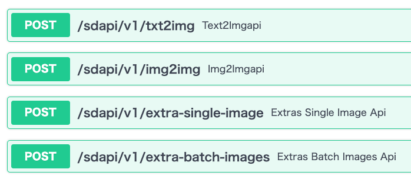
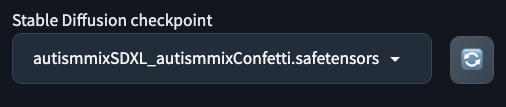
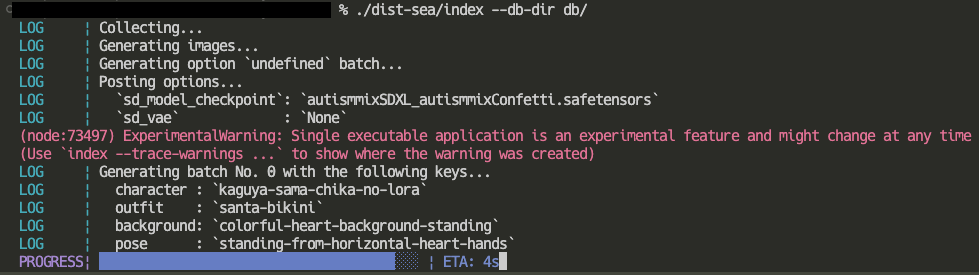
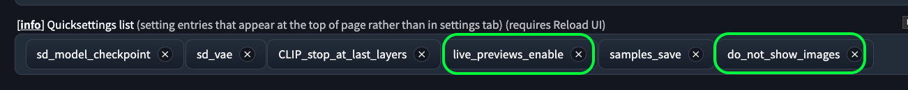
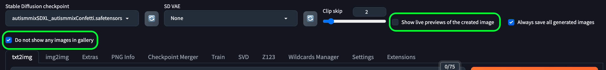

# sd-random-generator

[](./readme.md)
[](./readme-ja.md)

🎲 Stable Diffusion web UIのAPIを使った、キャラ、服装、背景、ポーズのランダム生成機 🎲

## ✨ 機能

- キャラ、服装、背景、ポーズをランダムに生成
- 各設定の整合性を保った生成
  - 例: （デフォルト設定では）学生キャラは汎用コスプレ衣装と作中の制服を着用し、それ以外の服装は着ない。
  - 例: （デフォルト設定では）チアコスを着る場合、青空背景でチアリーディングポーズを取る。
- ポーズごとの服装関連タグの取捨選択
  - 例: `upper body` や `portrait` のときは `skirt` などの腰から下のタグは無効になる。
  - 例: `navel` などの体の前面からしか見えない部位は、前面が映るポーズのときだけ有効になる。
- 特殊なタグ（プロンプト）の自動付与
  - 例: お胸の豊かなキャラ、かつ、体の前側が見えるポーズのときだけ `cleavage` （谷間）が有効になる。
  - 例: 八重歯っ娘キャラは口を開けたときだけ `fang` （八重歯）が有効になる。
- 柔軟な設定
  - 例: 特定のキャラのみ（複数指定OK）をランダムで生成できる。
  - 例: お気に入りのコスプレだけを着せれる。
  - 例: 特定のCheckpointで100枚生成した後、別のCheckpointで100枚生成といったことができる。

## 💿 前提環境

↓が使える（インストールされている）状態であることを前提に動作します。

- [Stable Diffusion web UI](https://github.com/AUTOMATIC1111/stable-diffusion-webui)
  - [Forge](https://github.com/lllyasviel/stable-diffusion-webui-forge) でもOK
- [Node.js](https://nodejs.org)
  - Exe版ツールを使う場合は不要
- [Git](https://www.git-scm.com/)
  - Exe版ツールを使う場合は不要だが、web UIのインストールでどうせ必要になる。

必須ではないが、最低でもYAMLを編集することになるので
[VSCode](https://code.visualstudio.com)
などのプログラミング用エディタが使えると便利。

## 📛 Getting Started

### 1. web UIのAPIの有効化

web UIのディレクトリを開き、 `webui-user.bat` （Macの人は適宜読み替えてね）を開く。
`COMMANDLINE_ARGS` に `--api` を追加する↓。

```bat
set COMMANDLINE_ARGS=--api
```

既に `--listen` などの別オプションを指定している場合は、
`--listen --api` のようにスペース区切りで追加すること。

web UIを起動（or 再起動）する。

Webブラウザから↓にアクセスする。

- `http://{web UIのIPとポート}/docs`

FastAPIのドキュメントページが開かれ、
`/sdapi/v1/txt2img` などのAPIが表示されていればAPI有効化OK❗



### 2. Exe版ツールによる生成

話を簡単にするため、Exe版ツールを前提に解説する。

### 2-1. データベースファイルのコピー

↓のデータベースファイル（YAML）の入ったディレクトリを任意のディレクトリにコピーする。

- [`./db`](./db/)

<!-- TODO: dbごとzipに固めよう。それだったらDBファイルもGit登録しなくて良い。 -->

### 2-2. 設定ファイルの変更

`default-setting.yaml` が生成設定ファイルになっている。
これを変更していく。
なお、話を簡単にするため、ここでは最低限必要な部分のみを変更する。

### 2-3. 設定ファイルの変更: PC設定の変更

生成するPCの設定を自分のPC設定に変更する↓。

```yaml
machine:
  ip: 192.168.10.3
  port: 7860
```

例えば、IPを `localhost` で使ってる人は `ip: localhost` にする。

### 2-4. 設定ファイルの変更: CheckpointとVAEの変更

CheckpointとVAEを自分が使っているものに変更する↓。

```yaml
optionSettings:
  - optionsBodyJson:
      sd_model_checkpoint: autismmixSDXL_autismmixConfetti.safetensors
      sd_vae: None
```

CheckpointとVAEの名前はweb UIの画面上で表示されるものをコピペすれば良い↓。



### 2-5. 設定ファイルの変更: キャラの変更

生成対象のキャラを変更する。
ここでは例として、か◯や様の副会長と書紀ちゃんを設定する↓。

```yaml
characters: &a1
  - key: kaguya-sama-kaguya-no-lora
    outfits: []
  - key: kaguya-sama-chika-no-lora
    outfits: []
```

`&a1` はYAML内部でエイリアス参照するためのアンカー。
YAMLに詳しくない人は無視して良い。

`key` に指定する文字列は `character.yaml` で定義されたものが使える。
末尾に `no-lora` とついたものは、Loraなしで生成する（Pony系Checkpointの自力に頼る）ことになる。

`outfits` が空配列となっている場合、デフォルト設定で生成することになる。
副会長と書紀ちゃんの場合、秀◯院の制服と各種コスプレ衣装をランダムで生成する。

### 4. 生成

↓のコマンドを実行すると生成開始。

```sh
sd-random-generator.exe --db-dir "db/"
```

↓のようにプログレスバーが表示されればOK❗



なお、 `ExperimentalWarning` の警告が出た場合は無視でOK。
（Node.jsの
[Single Executable Applications](https://nodejs.org/api/single-executable-applications.html)
がまだ実験的機能のために出てくる警告。）

## 🔷 Q&A

### 「このツールを使ったらweb UIでプレビュー表示されなくなった❗」

そういう仕様です。

ランダム生成中にプレビュー画像や生成結果画像を送信しないようにしている。
無駄なので。

有効化するには再度設定する必要がある。

オススメの対処方法はweb UIで
`live_previews_enable` と `do_not_show_images` の
設定を画面上部に常に表示するようにすること。



web UIで生成する場合は↓のチェックボックスをON/OFFすると
再びプレビュー表示されるようになる。



なお、チェックボックスの切り替えをトリガに設定が反映されるので、
『Show live previews of the created image』が既にONになっていても、
一度OFFにしてONにしなおす必要がある。
